# ComfyUI-TrixLoader

[](README.md) [](README_RU.md)

An elegant, all-in-one, high-performance image workflow node for [ComfyUI](https://github.com/comfyanonymous/ComfyUI). Load, crop, paint masks, correct colors with professional Camera Raw tools, and scale images seamlessly in a single unified interface.


---

## 📌 Navigation

1. [🧰 Independent Toolbox & Context Menu](#-independent-toolbox--context-menu)
2. [⚙️ Advanced Editor Workspaces](#️-advanced-editor-workspaces)
   - [🎬 Live Camera Raw](#-live-camera-raw)
   - [🖌️ Advanced AI Mask Editor](#️-advanced-ai-mask-editor)
   - [📐 Crop-Pad-Outpaint (CPO) Editor](#-crop-pad-outpaint-cpo-editor)
3. [🌊 Load Image AIO Node & Inline Modes](#-load-image-aio-node--inline-modes)
   - [☘︎ Preview Mode](#-preview-mode)
   - [🎬 Filter Mode (Inline)](#-filter-mode-inline)
   - [🖌️ Mask Mode (Inline)](#-mask-mode-inline)
   - [📐 Resize Mode (Inline)](#-resize-mode-inline)
4. [🛠️ Node Settings & Customization](#️-node-settings--customization)
5. [💾 Save Paths & Model Downloads](#-save-paths--model-downloads)
6. [⚠️ Limitations](#️-limitations)
7. [🚀 Installation](#-installation)
8. [🎁 Release Changelog (v2.5)](#-release-changelog-v25)

---

## 🧰 Independent Toolbox & Context Menu

In v2.5, you can run all advanced editors on **any node** that produces or accepts an image. You are no longer restricted to the Load Image AIO node!

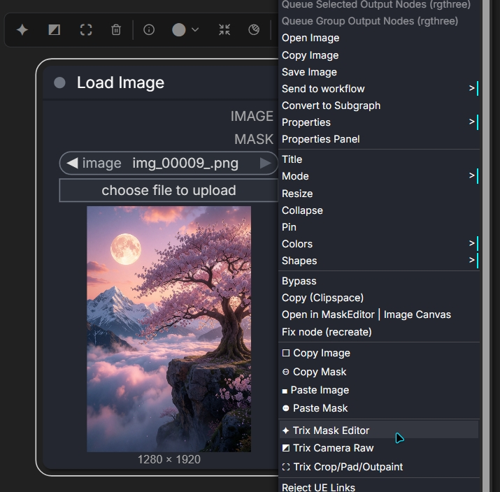

### Features & Settings:
* **Floating Node Toolbox**: Appears directly above any compatible node (e.g. Load Image, Preview Image, Save Image) providing quick access buttons to Camera Raw, Mask Editor, and Crop Editor.
* **Right-Click Context Menu**: Integrates options directly into ComfyUI's native context menu:
  - *trx adv. camera raw*
  - *trx adv. mask editor*
  - *trx adv. crop/pad/outpaint*
  - *Copy Image / Paste Image / Copy Mask / Paste Mask*
* **Mask Clipboard**: Instantly copy drawn masks from one node and paste them onto another node across the workflow.


https://github.com/user-attachments/assets/b178e1b1-3e14-4e61-9a7f-dd1220b07add


---

## ⚙️ Advanced Editor Workspaces

---

### 🎬 Live Camera Raw

A professional Lightroom-style workspace with advanced adjustment sliders, HSL panel, and color curves.

| Basic Adjustments & pixelize & sketch | HSL Colors & Curves |
| :---: | :---: |
| 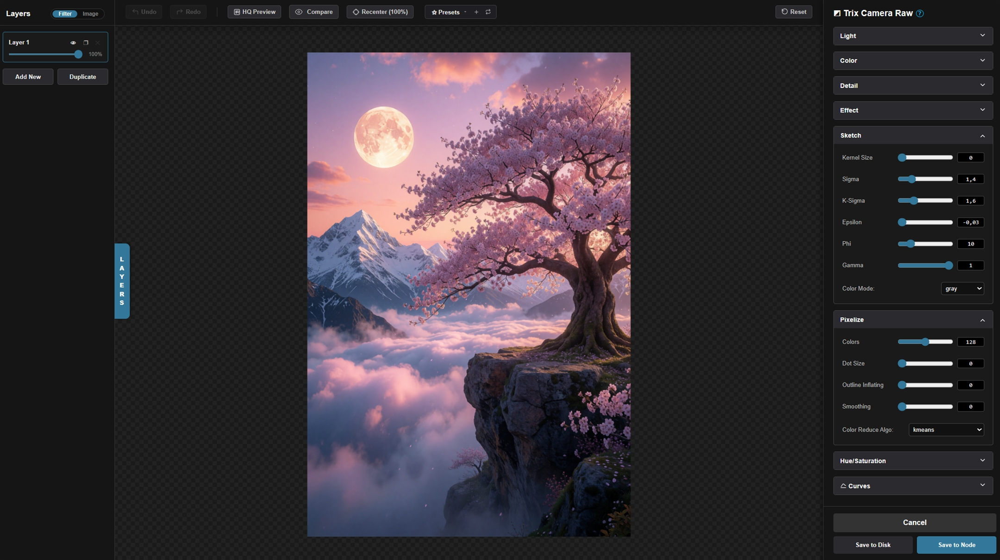 | 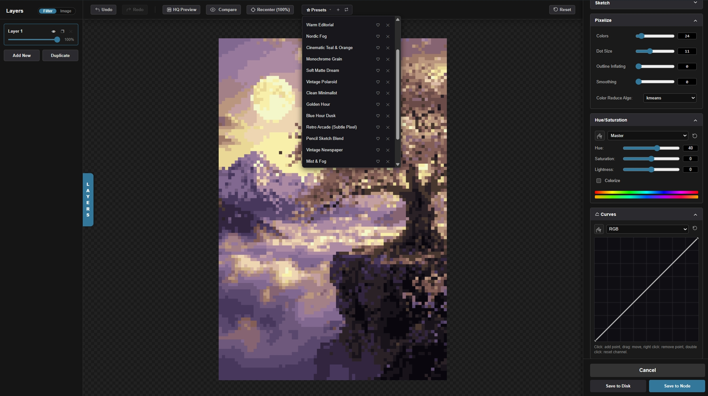 |

#### Features:
- **Liquid-Smooth Previews**: requestAnimationFrame-throttled cooperative rendering updates preview canvas instantly as you drag sliders.
- **Layers Panel**: Create multiple color correction layers in the sidebar, operating either in overlay `filter` mode or composite `image` mode.
- **Custom Presets**: Save your favorite grading styles, mark them as favorites, and quickly import/export styles using preset codes.
- **HSL Color Picker (Finger Icon)**: Click and drag horizontally over the image to adjust the saturation of that specific color range in real-time.
- **Curve Graph**: Precise curve controls for RGB, Red, Green, and Blue channels.

#### Shortcuts & Tips:
- **Double-click Curve Grid**: Resets the current channel to linear.
- **Right-click Curve Point**: Deletes the selected point.
- **Double-click Slider / Label**: Resets the slider to its default value.
- **Mouse Wheel / Middle Click**: Zoom and pan the preview image.
- <kbd>Esc</kbd>: Close the workspace without saving.

---

### 🖌️ Advanced AI Mask Editor

A powerful editing space combining traditional brushes with advanced neural network models.

| SAM AI Segmentation | SAM PRO Viewport Focus | RMBG Background Removal |
| :---: | :---: | :---: |
| 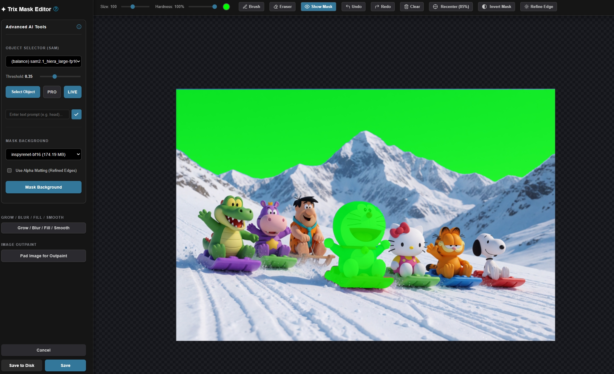 | 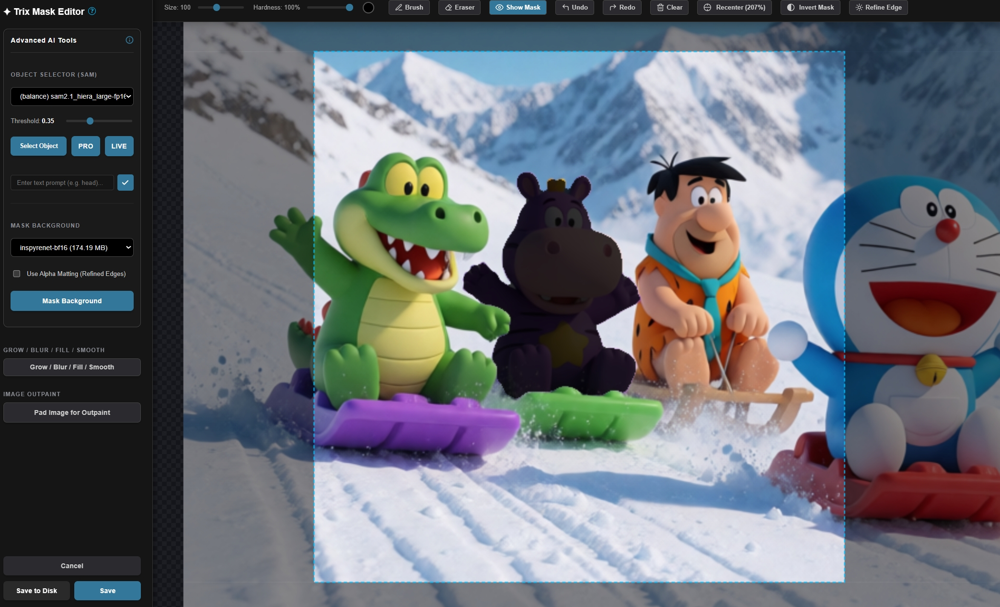 | 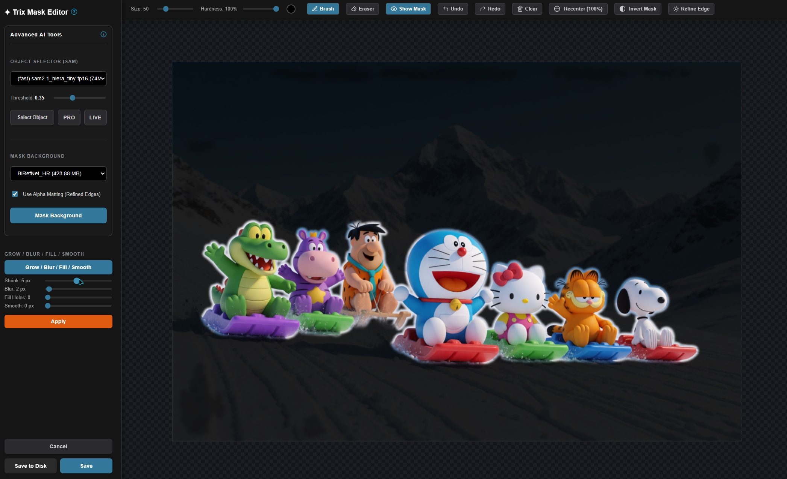 |

#### Features & AI Models:
- **Segment Anything (SAM)**: Select a model and click on an object to segment it.
  - Models: [SAM 2.1 Hiera Tiny](https://huggingface.co/Kijai/sam2-safetensors), [SAM 2.1 Hiera Large](https://huggingface.co/Kijai/sam2-safetensors), and [SAM 3](https://huggingface.co/yolain/sam3-safetensors).
  - **SAM PRO Mode**: Dynamically crops the attention window to your zoomed viewport (dashed blue border). Focuses SAM on fine details while ignoring background clutter.
- **GroundingDINO (Text-to-Mask)**: Automatically generate masks by typing queries (e.g. "sunglasses", "jacket").
- **Remove Background (RMBG)**: Isolate subjects instantly using RMBG models ([InspyreNet](https://huggingface.co/dummy9996/inspyrenet-bf16), [BEN2](https://huggingface.co/PramaLLC/BEN2), [BiRefNet](https://huggingface.co/ezzdev/BiRefNet)).
  - **Alpha Matting**: Apply refined edge processing for soft anti-aliased transitions.
- **Mask Post-processing**: Adjust Dilation (Grow), Blur, and output opacity dynamically.

#### Shortcuts & Tips:
- <kbd>Alt</kbd> + **Right Click** + **Drag**: Interactively adjust brush size (drag horizontally) and hardness (drag vertically).
- **Right Click (Hold & Drag)**: Temporary eraser brush.
- <kbd>Ctrl</kbd> + **Left Click**: Smart flood fill.
- <kbd>Shift</kbd> + **Left Click**: Draw straight lines (drag with Shift to snap to axes).
- **Mouse Wheel / Middle Click**: Zoom and pan the canvas.
- <kbd>Esc</kbd>: Close the editor.

---

### 📐 Crop-Pad-Outpaint (CPO) Editor

For resizing, scaling, cropping, and padding images.

| Rotation, Mirroring & Outpaint Swatches | Interactive Cropping Board |
| :---: | :---: |
| 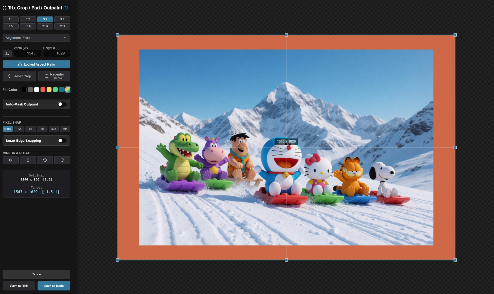 | 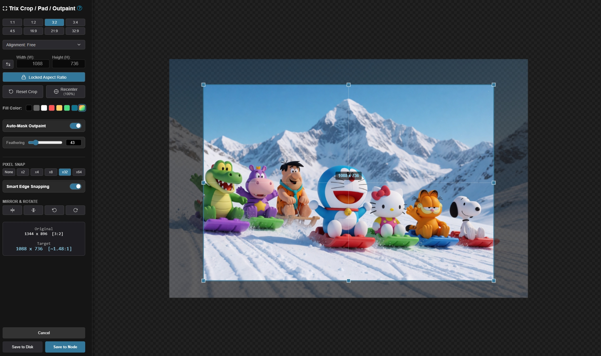 |

#### Features:
- **Symmetric Scaling**: Symmetrically pad or crop images from all edges.
- **Auto-Mask Outpaint**: Automatically creates a mask for newly padded outpaint regions.
- **Resolution Snapping**: Snap dimensions to clean multiples (`x2`, `x4`, `x8`, `x32`, `x64`) for model compatibility.
- **Quick Alignment**: Presets to center, align left, top, right, bottom.
- **Rotation & Mirroring**: Mirror horizontally/vertically or rotate CW/CCW.

#### Shortcuts & Tips:
- <kbd>Shift</kbd> + **Drag Corner**: Forces a locked aspect ratio.
- <kbd>Alt</kbd> + **Drag Corner**: Symmetrical scale from the center point.
- **Mouse Wheel / Middle Click**: Zoom and pan the workspace.
- <kbd>Esc</kbd>: Exit editor.

---

## 🌊 Load Image AIO Node & Inline Modes

The **Load Image AIO** node is a unified workspace designed to handle your entire input prep pipeline. Instead of linking multiple separate nodes, you can switch between **Preview**, **Filter**, **Mask**, and **Resize** tabs to apply adjustments sequentially inside the node.

---

### ☘︎ Preview Mode

Used for clean, distraction-free previewing of your image inside the node. No bars or sliders are shown.

---

### 🎬 Filter Mode (Inline)

Used for quick adjustment parameters inside the node interface.

| Filter Adjustments | Active Settings |
| :---: | :---: |
| 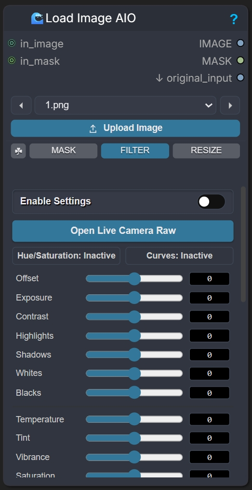 | 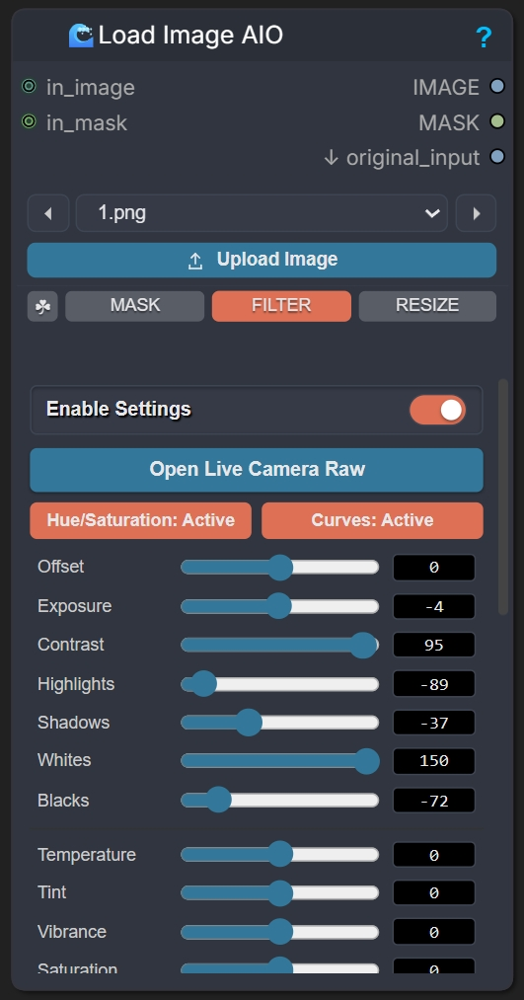 |

---

### 🖌️ Mask Mode (Inline)

Used for quick mask drawing and previewing inside the node interface.

| Inline Brush Drawing | Opacity & Color Selector Overlay |
| :---: | :---: |
| 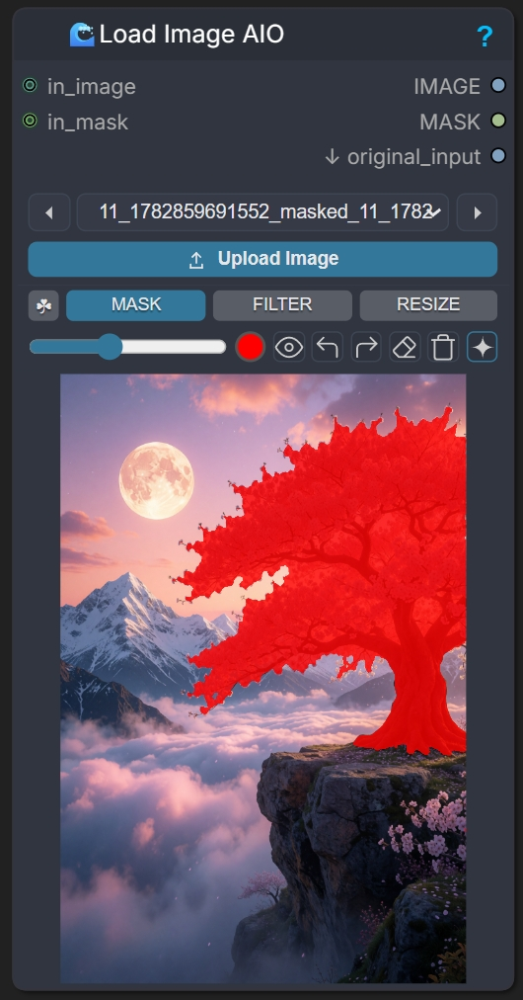 | 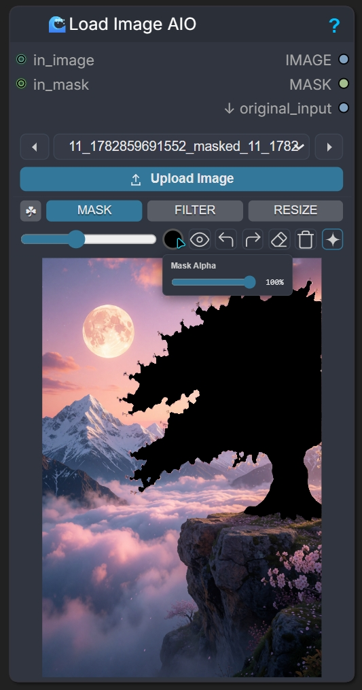 |

---

### 📐 Resize Mode (Inline)

Used for crop inputs, padding settings, and snap limits inside the node interface.

| basic resizing | scale by option | Outpaint Options | Crop with interactive panel |
| :---: | :---: | :---: | :---: |
| 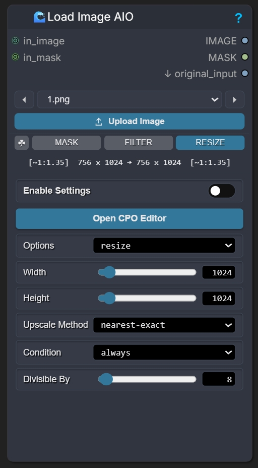 | 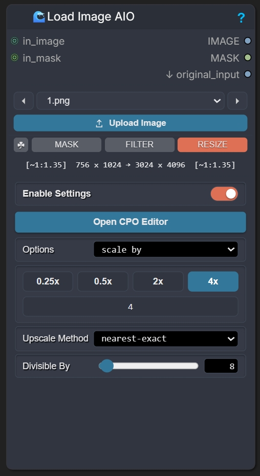 | 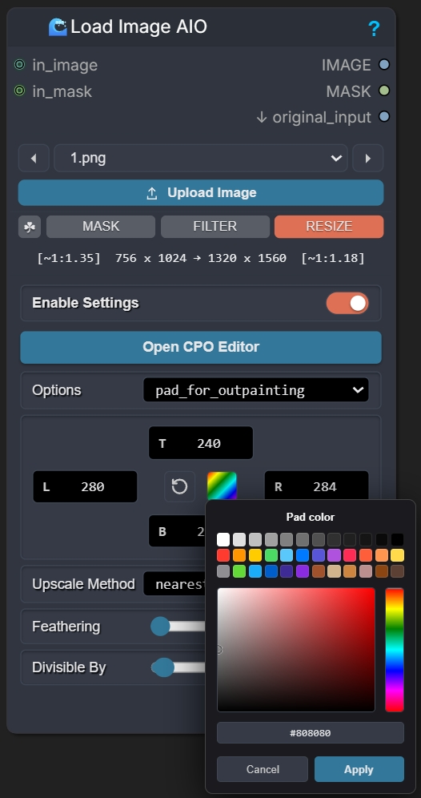 | 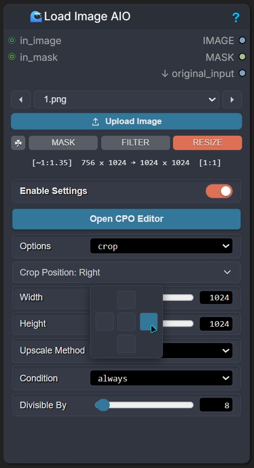 |

---

## 🛠️ Node Settings & Customization

You can fully customize the behavior and visual aesthetics of ComfyUI-TrixLoader via ComfyUI's native **Settings Dialog**:

| Custom Settings Panel | Custom Node Style |
| :---: | :---: |
| 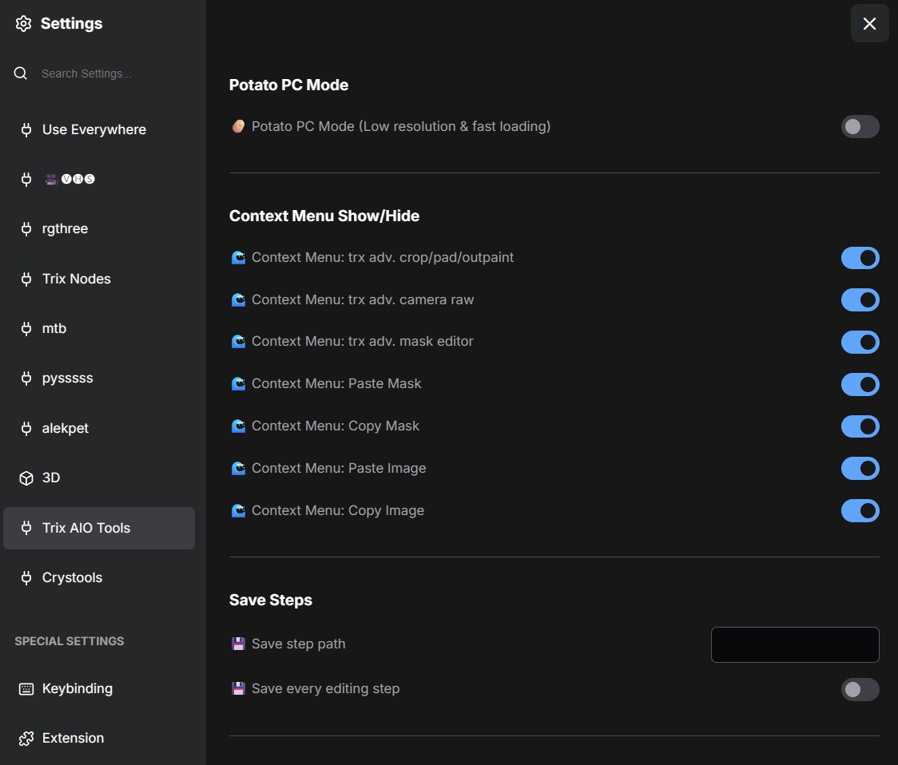 | 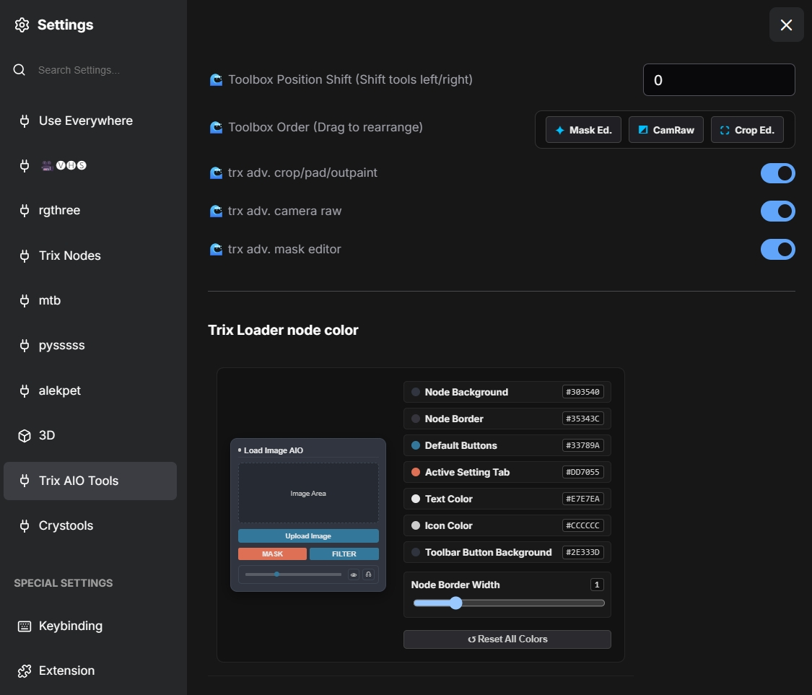 |

- **Potato PC Mode**: Disables editor transitions/animations and limits canvas previews to `512px` (default `false` renders sharp `1200px` canvas).
- **Custom Node Colors**: Re-color AIO node background, text, active tabs, toolbars, and buttons using color pickers.
- **Toolbox Configuration**: Enable or disable the toolbox for specific nodes, change toolbox positions, and hide unwanted items.

---

## 💾 Save Paths & Model Downloads

- **Save Path**: Processed images and intermediate step images are saved in `ComfyUI/input/aio_input/` (e.g. `aio_wired_*.png` or `trix_edited_*.png`).
- **Model Downloads**:
  - SAM models: Saved to `ComfyUI/models/sam2/` or HuggingFace cache.
  - RMBG / GroundingDINO: Cached inside HuggingFace cache folders.
  - **Important note on first runs**: On the first execution of SAM 3 or other models, the download may halt at 100%. This is expected, as python compiles dependencies and initializes Triton mocks. Please check your console terminal for updates.

---

## ⚠️ Limitations

1. **Non-reversible edits (Save to Node)**: You cannot undo crop or filters after clicking "Save to Node" because it modifies the base image file inside the workflow, which prevents loop duplicates in the input directory.
2. **Crop Snapping**: Symmetrical smart snapping in CPO editor helps clip empty pad borders, but operates with close approximations and might shave off a few edge pixels.
3. **Photoshop Camera Raw Match**: While parameters are optimized to ~95% matched accuracy to Photoshop, complex curve math and filter stacks behave slightly differently than Adobe's native desktop engine.
4. **SAM 3 Precision**: SAM 3 works best in prompt-text mode; point selection can occasionally capture surrounding components. Use **SAM PRO** to crop attention boundaries to the zoom box.

---

## 🚀 Installation

### Method 1: Via Git (Manual)
1. Go to `ComfyUI/custom_nodes/`
2. Clone this repository:
   ```bash
   git clone https://github.com/trx7111/ComfyUI-TrixLoader.git
   ```
3. Restart ComfyUI.

### Method 2: Via ComfyUI Manager
1. Open ComfyUI Manager -> click **Install via Git URL**.
2. Paste the URL: `https://github.com/trx7111/ComfyUI-TrixLoader`
3. Click Install and restart ComfyUI.

---

## 🎁 Release Changelog (v2.5)

### ⭐ Major Changes
- **Toolbox & Context Menu Independence**: Run Camera Raw, Crop Editor, and Mask Editor on any image-producing node. Fully independent of the AIO node.
- **Mask Clipboard**: Added Copy Mask & Paste Mask support between nodes.
- **SAM Compatibility**: Advanced Mask Editor masks are fully compatible with ComfyUI's native mask editor.

### 🎬 Camera Raw Improvements
- **Logical Groupings**: Sliders are structured into Basic, HSL, Curves, and Details panels.
- **Custom Presets**: Save, favorite, and share preset codes.
- **Layers Panel**: Overlay multiple color correction layers (Filter or Composite Image).

### ⚙️ Customization & Optimization
- **UI Customizer**: Fully customize toolbox configurations and node element colors.
- **Potato PC Mode**: Settings option to limit canvas previews and turn off editor animations.
- **Better Execution Flow**: Applying both Filter and Resize modes now correctly processes filters *first* and crops/pads *second*, ensuring clean border fills.
- Fixed performance lag and micro-freezes.

---
Created by **Trix** for the **StableDif & AINetSD Group** community.
