# ComfyUI-TrixLoader

[](README.md) [](README_RU.md)

An elegant, all-in-one, high-performance image workflow node for [ComfyUI](https://github.com/comfyanonymous/ComfyUI). Load, crop, paint masks, correct colors with professional Camera Raw tools, and scale images seamlessly in a single unified interface.

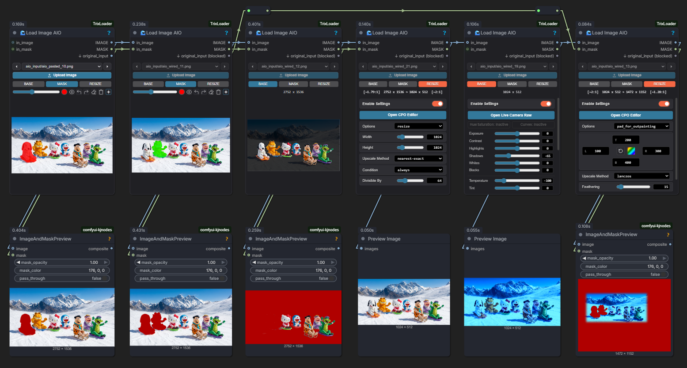

---

## 📌 Table of Contents
1. [🌟 Core Features](#-core-features)
2. [🔌 Inputs and Outputs](#-inputs-and-outputs)
3. [⚙️ Operating Modes](#️-operating-modes)
   - [🎬 Base Mode & Live Camera Raw](#-base-mode--live-camera-raw)
   - [🖌️ Mask Mode & Advanced AI Mask Editor](#️-mask-mode--advanced-ai-mask-editor)
   - [📐 Resize Mode & CPO Editor](#-resize-mode--cpo-editor)
4. [⚠️ Important Notes](#️-important-notes)
5. [🛠️ Installation](#️-installation)

---

## 🌟 Core Features

- **All-in-One Workflow**: Replaces multiple nodes for cropping, color correction, resizing, and masking.
- **Advanced AI Mask Editor**: Point-and-click segmentation (SAM), prompt-based masking (GroundingDINO), and instant background removal (RMBG).
- **Professional Color Grading**: Full-fledged Live Camera Raw panel with HSL adjustment sliders and RGB/Red/Green/Blue color curves.
- **Interactive Crop-Pad-Outpaint (CPO) Editor**: Symmetrical scaling, border snapping, quick alignment presets, image rotation, mirroring, and outpaint color selection.
- **Real-time Performance**: Smooth GPU-accelerated rendering and offscreen canvas caching.

---

## 🔌 Inputs and Outputs

- **in_image** *(optional)*: Input external image for processing. If connected, the original image loader is bypassed and the `original_input` output port is blocked to prevent loop feedback errors.
- **in_mask** *(optional)*: Input external mask to layer/combine.
- **IMAGE**: The final processed output image (cropped, color graded, and scaled).
- **MASK**: The drawn or AI-generated mask channel.
- **original_input**: The raw, unprocessed source image (active only when using the internal loader).

---

## ⚙️ Operating Modes

The node is divided into 3 distinct, switchable operation modes.

### 🎬 Base Mode & Live Camera Raw

Used for basic image loading, quick adjustments, and professional color grading. Double-click the **Base** tab on the node to toggle the quick adjustments panel.

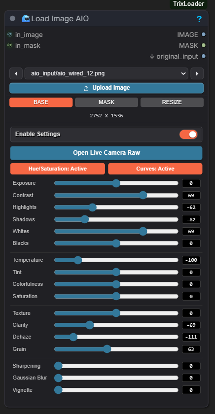

#### Live Camera Raw:
Click **Open Live Camera Raw** to access a Lightroom-style workspace with advanced sliders, HSL adjustments, and graph curves.

| Curves & Basic Sliders | HSL & Details Panel |
| :---: | :---: |
| 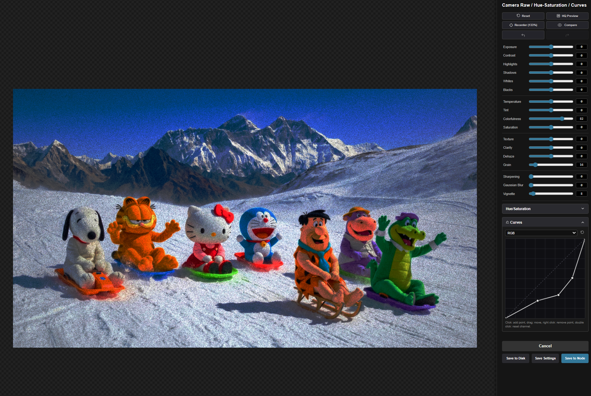 | 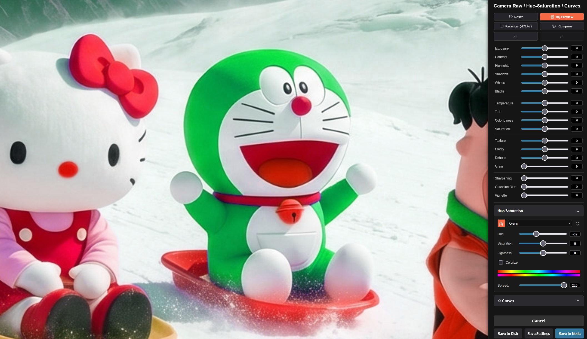 |

#### Features & Shortcuts:
* **Real-time Processing**: Fast 60 FPS GPU-accelerated updates with offscreen rendering optimization.
* **HSL Color Picker (Finger Icon)**: Click and drag horizontally directly over any color in the image preview to adjust the saturation of that color range in real-time.
* **Curve Controls**: Double-click on the curve grid to reset the current channel to linear. Right-click any point on the curve to delete it.
* **Parameter Reset**: Double-click any slider or numerical label to reset its value to the default.
* **Zoom & Pan**: Use the mouse wheel to zoom and hold the middle mouse button (or drag) to pan the preview.
* **Exit**: Press <kbd>Esc</kbd> to close without saving.

---

### 🖌️ Mask Mode & Advanced AI Mask Editor

Designed for manual mask painting and AI-assisted segmentation. Double-click the **Mask** tab or click the **Star Icon** on the node toolbar to open the full-screen editor overlay.

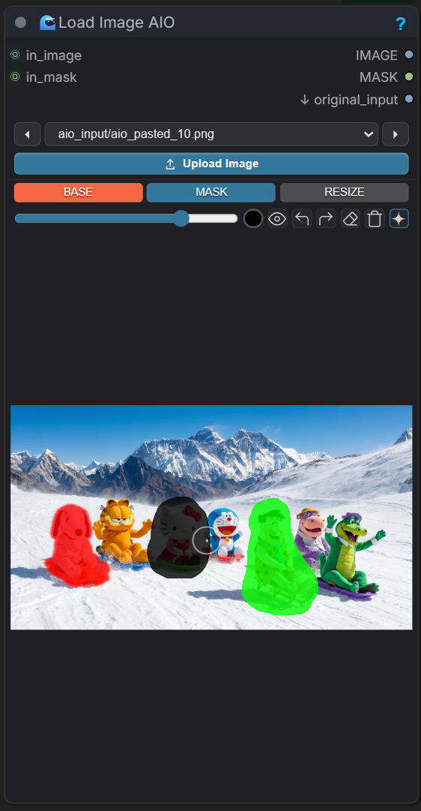

#### Advanced AI Mask Editor:
A powerful editing space combining traditional brushes with advanced neural network models.

| Main Canvas & Drawing | AI Segmentation (SAM) |
| :---: | :---: |
| 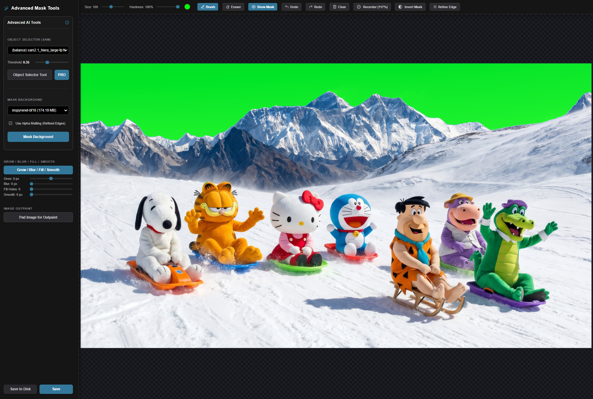 | 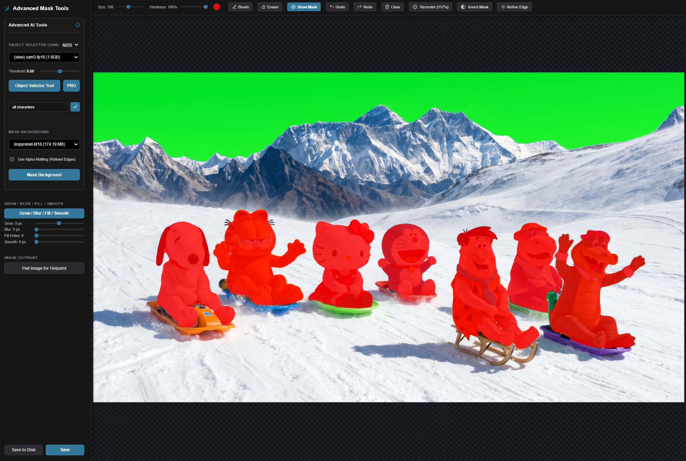 |
| **Background Removal (RMBG)** | **Post-processing & Outpaint Pad** |
| 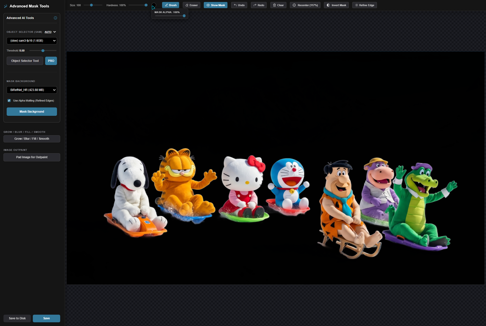 | 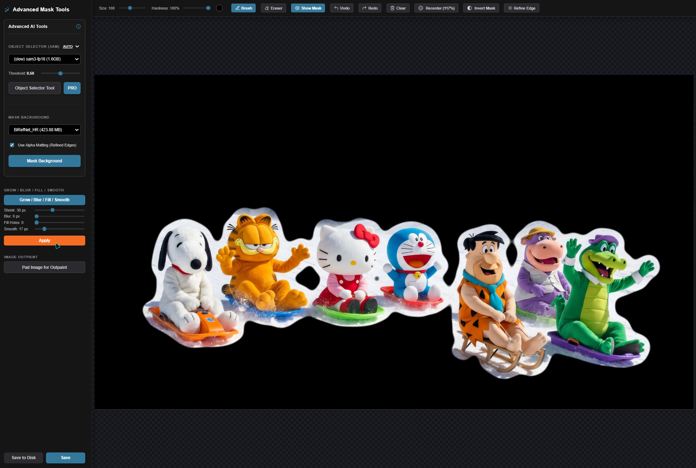 |

#### Features & AI Models:
* **Segment Anything (SAM)**: Toggle the SAM tool, select a model, and click on an object to segment it.
  - Supported models: [SAM 2.1 Hiera Tiny](https://huggingface.co/Kijai/sam2-safetensors), [SAM 2.1 Hiera Large](https://huggingface.co/Kijai/sam2-safetensors), and [SAM 3](https://huggingface.co/yolain/sam3-safetensors).
  - Prompts: Left-click to add foreground points (+), Right-click to add multiple points (++).
  - **SAM PRO Mode**: When enabled, the model automatically post-processes the mask to eliminate small noise (salt-and-pepper noise), closes internal gaps/holes using morphological filters, and isolates only the connected mask clusters containing your prompt points.
* **Text Detection (GroundingDINO)**: Type text queries (e.g., "glasses", "hair") and click Detect to automatically generate masks using the [GroundingDINO SwinT OGC](https://huggingface.co/IDEA-Research/grounding-dino-tiny) model.
* **Remove Background (RMBG)**: Isolate objects or subjects instantly.
  - Supported models: [InspyreNet](https://huggingface.co/dummy9996/inspyrenet-bf16), [BEN2](https://huggingface.co/PramaLLC/BEN2), [BiRefNet Standard](https://huggingface.co/ezzdev/BiRefNet), [BiRefNet HR](https://huggingface.co/ZhengPeng7/BiRefNet_HR), [BiRefNet Portrait](https://huggingface.co/ZhengPeng7/BiRefNet-portrait), and [BiRefNet Toonout](https://huggingface.co/joelseytre/toonout).
  - **Alpha Matting (Refined Edges)**: Toggle this checkbox to apply advanced boundary refinement. It computes soft, anti-aliased transitions for fine structures like hair, fur, or semi-transparent details, producing a flawless edge cutout.
* **Post-processing**: Adjust Grow (dilation) and Blur sliders in real-time to refine mask edges. Scale mask output opacity dynamically.
* **Pad for Outpaint**: Click this button to instantly open the Crop/Pad editor, resize/extend your canvas, and return directly to the Mask Editor with coordinates aligned and your drawing intact.
* **Save to Disk**: Save your mask directly to disk with a dark gray button styled at `rgb(42, 42, 42)`.

#### Shortcuts:
* <kbd>Alt</kbd> + **Right Click** + **Drag**: Adjust brush size (move mouse horizontally) and hardness (move mouse vertically) interactively.
* **Right Click (Hold & Drag)**: Acts as an eraser on the fly while drawing.
* <kbd>Ctrl</kbd> + **Left Click**: Smart flood fill for enclosed mask regions.
* <kbd>Shift</kbd> + **Left Click**: Draw a straight line from the last point. Dragging with Shift locks the line to vertical/horizontal axes.
* **Mouse Wheel**: Zoom in/out of the canvas.
* **Middle Mouse Click + Drag**: Pan the canvas.
* <kbd>Esc</kbd>: Exit editor.

---

### 📐 Resize Mode & CPO Editor

For resizing, scaling, cropping, and padding images.

| Resize settings | Aspect Lock & Fill | Resolution Snap |
| :---: | :---: | :---: |
| 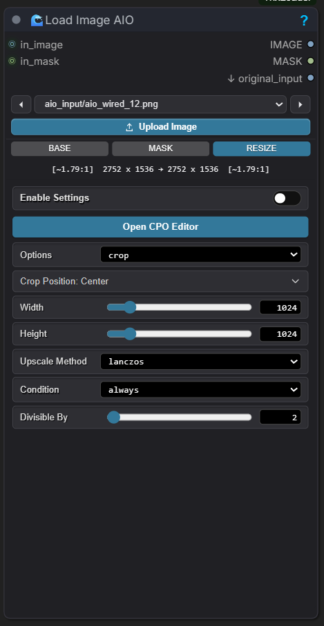 | 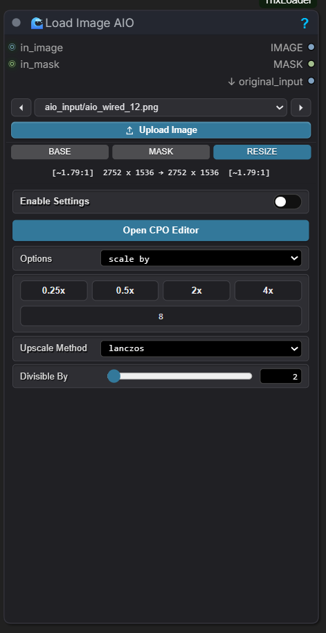 | 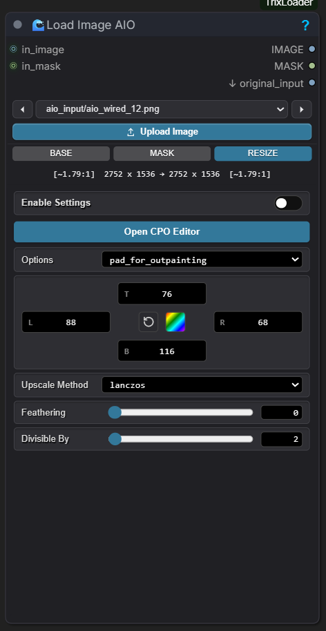 |

#### Crop-Pad-Outpaint (CPO) Editor:
Double-click the **Resize** tab or click the **Crop Icon** on the node toolbar to open the full-screen CPO workspace.

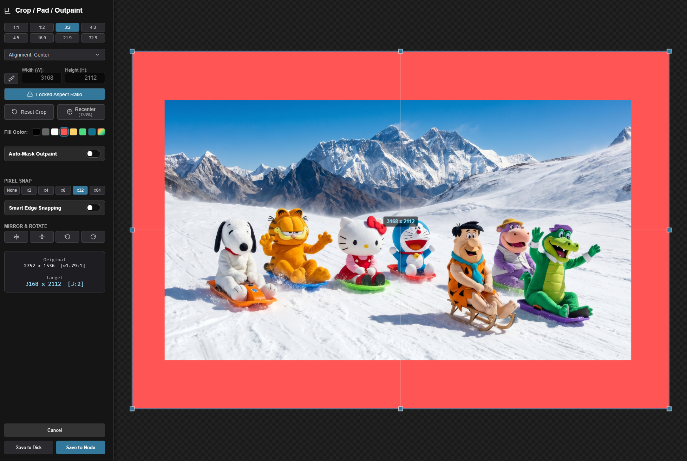

#### Features:
* **Border Snapping**: Snapping to image boundaries has been doubled in strength for precise alignment.
* **Alignment Panel**: Quick alignment presets (e.g., Center, Top-Left, Bottom-Right, etc.).
* **Mirror & Rotate**: Flip the image horizontally/vertically or rotate it 90 degrees (CW/CCW).
* **Outpaint Padding Color**: Choose a fill color from the 7 standard swatches or select a custom color.
* **Auto-Mask Outpaint**: When enabled, newly padded outpaint regions are automatically converted into a mask.

#### Shortcuts:
* <kbd>Shift</kbd> + **Drag Corner**: Forces a locked aspect ratio during cropping.
* <kbd>Alt</kbd> + **Drag Corner**: Scales the crop box symmetrically from the center.
* **Pixel Snap**: Round coordinates and dimensions to steps of `x2`, `x4`, `x8`, `x32`, or `x64` for optimal rendering compatibility.
* **Mouse Wheel / Middle Click**: Zoom and pan the cropping board.
* <kbd>Esc</kbd>: Close without saving.

---

## ⚠️ Important Notes

> [!NOTE]
> **GroundingDINO Download**: When downloading the text-to-mask DINO model, it may appear to freeze. This is not a bug; it is downloading tokenizer and config snapshots in the background. Please wait for it to complete.

> [!IMPORTANT]
> **100% Download Hang**: If a download (especially SAM 3) finishes at 100% and halts, it is compiling python libraries and installing dependencies. Check your console terminal and wait for the successful installation toast inside the Mask Editor.

> [!TIP]
> **Brush Offset Fix**: If you encounter brush offset issues (usually after changing inputs like `in_image` / `in_mask`), simply stretch and shrink the node's dimensions on the workspace to recalculate coordinate grids. We recommend using the full-screen **Advanced Mask Editor** to completely bypass any viewport-related offsets.

> [!WARNING]
> **Model Downloading Issues**: Model downloading for SAM and RMBG is dependent on network connections and Hugging Face accessibility. We have attempted to handle exceptions gracefully, but cannot guarantee successful execution on all setups. We are actively collecting crash data to make this more reliable.

---

## 🛠️ Installation

### Method 1: Via Git (Manual)
1. Navigate to your ComfyUI custom nodes directory:
   ```bash
   cd ComfyUI/custom_nodes
   ```
2. Clone this repository:
   ```bash
   git clone https://github.com/trx7111/ComfyUI-TrixLoader.git
   ```
3. Restart ComfyUI.

### Method 2: Via ComfyUI Manager (Install via Git URL)
1. Open ComfyUI Manager in your browser.
2. Click on the **Install via Git URL** button.
3. Paste the repository URL: `https://github.com/trx7111/ComfyUI-TrixLoader`
4. Click Install and restart ComfyUI.

---

## 👨‍💻 Author
Created by **Trix** for the **StableDif** community.
