# ComfyUI-TrixLoader

[](README.md) [](README_RU.md)

> [!TIP]
> Want to test upcoming experimental features? Switch to our [beta branch](https://github.com/trx7111/ComfyUI-TrixLoader/tree/beta)!

A universal, stylish, and multi-functional (All-in-One) image loader for [ComfyUI](https://github.com/comfyanonymous/ComfyUI). Load, crop, mask, and scale images directly within a single convenient interface.

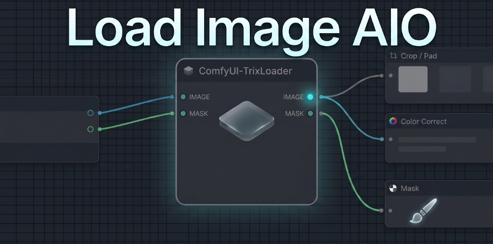

---

## 📌 Table of Contents
1. [🌟 Key Features](#-key-features)
2. [🔌 Inputs and Outputs](#-inputs-and-outputs)
3. [⚙️ Operation Modes (Detailed Breakdown)](#-operation-modes-detailed-breakdown)
4. [⌨️ Tricks and Shortcuts](#️-tricks-and-shortcuts)
5. [🔄 Recent Updates](#-recent-updates)
6. [🛠️ Installation](#️-installation)

---

## 🌟 Key Features

- **All-in-One**: No more cluttering the graph with separate nodes for loading, cropping, color grading, and resizing.
- **Built-in Crop Editor**: Interactive crop frame directly on the node canvas.
- **Smart Masking**: Brush masking with full Undo/Redo history and zoom support.
- **Professional Color Grading**: Controls for exposure, contrast, highlights/shadows, color temperature, vibrance, vignetting, and HSL.

---

## 🔌 Inputs and Outputs

Visual representation of the node and its connections in the ComfyUI graph:

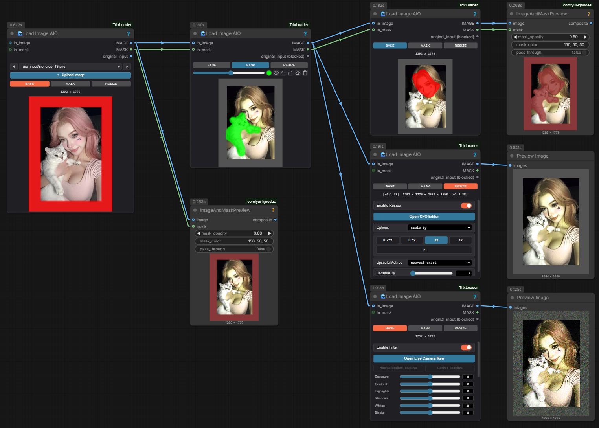

### Input Ports:
1. **in_image** *(optional)* — external incoming image for processing.
2. **in_mask** *(optional)* — external incoming mask.

### Output Ports:
1. **IMAGE** — final processed image (including crop, color grading, and scaling).
2. **MASK** — generated mask (drawn manually or passed from the input).
3. **original_input** — raw, unprocessed source image.
   - *Note*: If an external image is fed into the `in_image` port, this port is automatically `blocked` to prevent logical feedback loop errors.

---

## ⚙️ Operation Modes (Detailed Breakdown)

The node's capabilities are divided into 3 switchable modes, always accessible on the control toolbar.

### 🎬 1. BASE Mode (Basic Loading & Color Grading)

This mode is designed for standard image loading and basic processing. You can fine-tune colors, exposure, and contrast before passing the image down the graph. Double-click the **Base** tab to enter the advanced processing settings panel; double-click it again to exit.

| Standard Base Mode | Control Toolbar (BASE) |
| :---: | :---: |
| 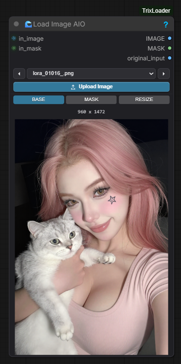 | 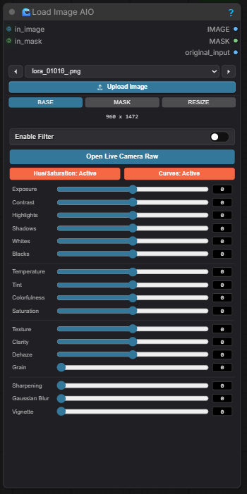 |

#### Live Camera Raw & Curves Interface:
Click the **open live camera raw** button to access a professional Camera Raw panel with advanced color correction, HSL adjustments, and Curve charts.

| Camera Raw Panel | Curves & HSL Settings |
| :---: | :---: |
| 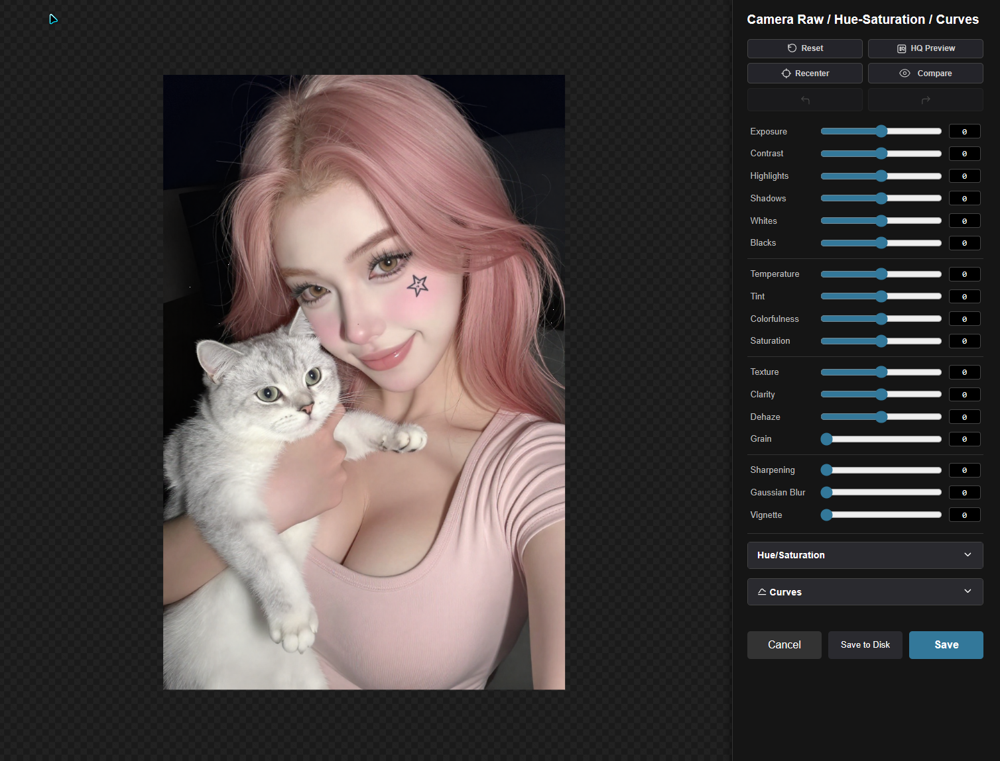 | 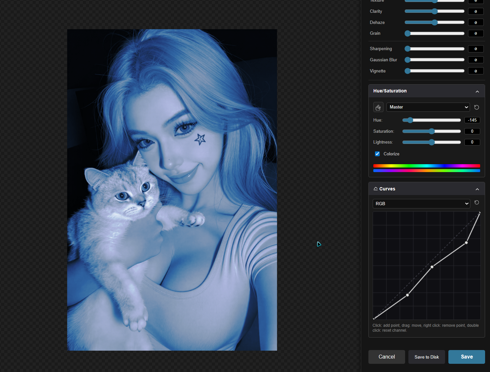 |

---

### 🖌️ 2. MASK Mode (Mask Drawing)

A mode with a built-in graphic mask editor. Allows you to quickly paint an inpainting mask right inside the node.

Double-click the **mask** tab to enter the full-screen mask editor; double-click it again to exit.

| Control Toolbar (MASK) | Mask Editor Canvas |
| :---: | :---: |
| 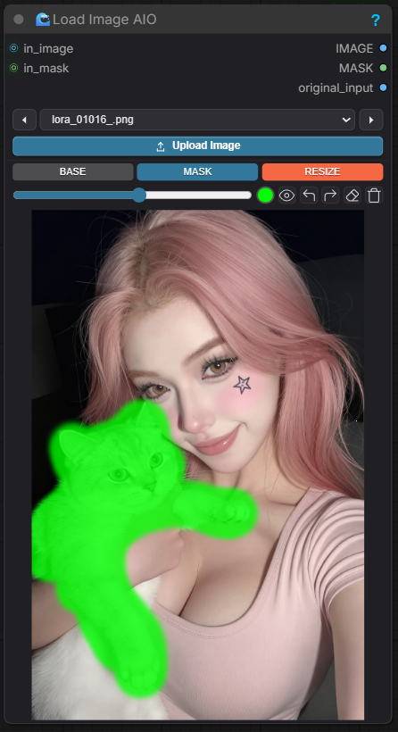 | 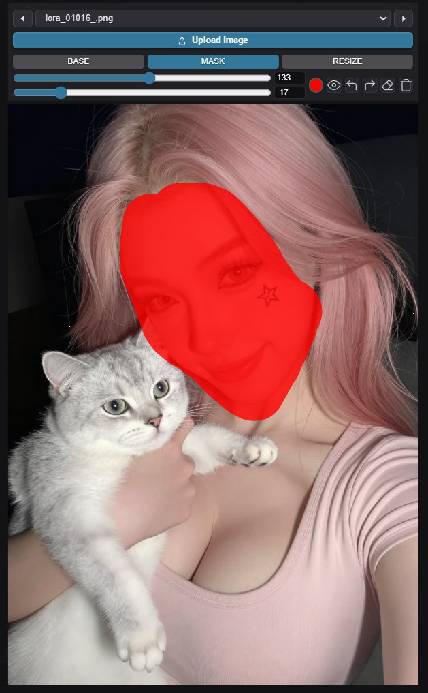 |

#### Available Tools:
* **Mask Color** (visual selection of the mask display color on the canvas). *Note: The display color does not affect the output mask (the MASK output is always a standard black-and-white mask).*
* **Eye Icon** (toggles mask visibility on the canvas).
* **Undo / Redo Buttons** — full action history for precise painting.
* **Eraser** (removes painted mask content).
* **Trash Icon** (clears the entire mask canvas).
* **Sliders** — smooth adjustment of brush size and hardness.

---

### 📐 3. RESIZE Mode (Resizing & Scaling)

A professional tool to resize image resolution with aspect ratio locking and smart padding options.

| Control Toolbar (RESIZE) | Scaling Options |
| :---: | :---: |
| 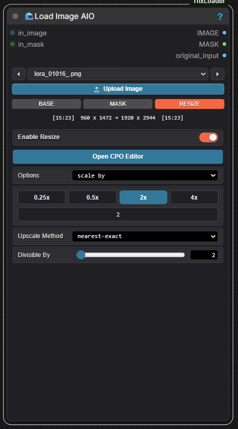 | 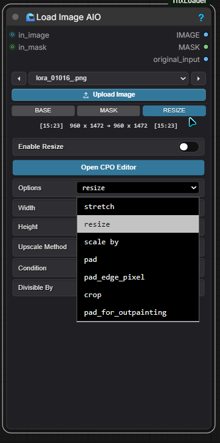 |

---

## ⌨️ Tricks and Shortcuts

The node is equipped with numerous hotkeys and hidden features to accelerate your workflow.

| Interactive Crop Editor | Auto-mask Outpaint | Context Menu |
| :---: | :---: | :---: |
| 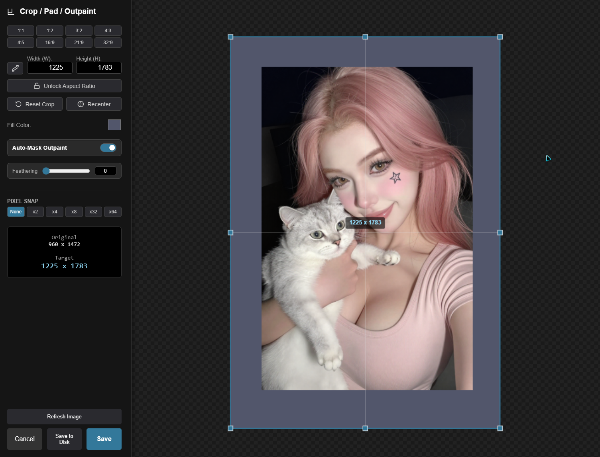 | 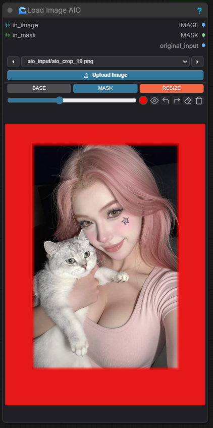 | 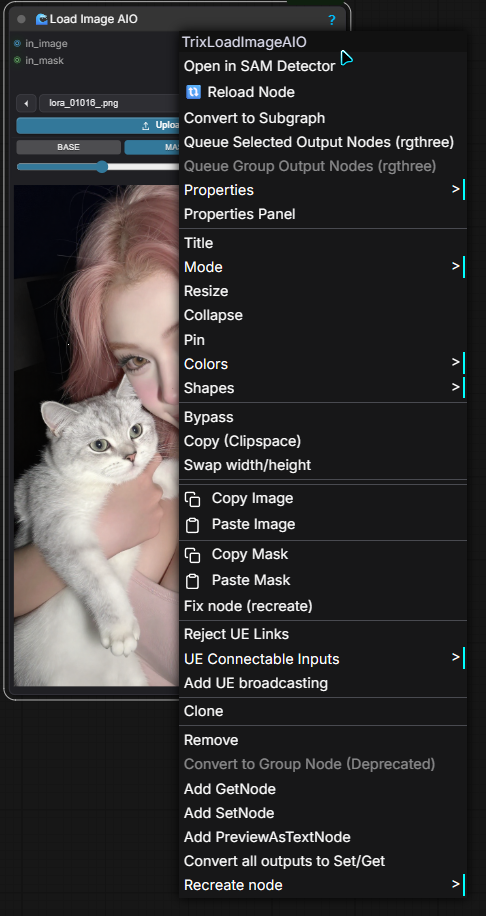 |

### 🎨 Mask Editor (Mask Mode)
* <kbd>Alt</kbd> + **Right Click** + **Drag** — interactively adjust brush size (horizontal movement) and hardness (vertical movement) directly on the canvas.
* <kbd>Ctrl</kbd> + **Left Click** — smart flood fill of enclosed mask areas.
* <kbd>Shift</kbd> + **Left Click** — draws a straight line from the last painted point to the current click. Holding Shift while dragging locks the line to vertical or horizontal axes.
* **Mouse Wheel** — Zoom in/out of the canvas in full-screen mode.
* **Middle Mouse Click / Wheel Click + Drag** — pan around the canvas.
* <kbd>Esc</kbd> — quickly exit the full-screen masking mode.

### 📐 Crop Editor & Outpaint
* **Auto-Mask Outpaint** — when toggled on, areas outside the original frame are automatically converted into a mask.
* **Feathering** — smooth outpaint mask edges for seamless blending.
* <kbd>Shift</kbd> + **Drag Corner Handle** — forces a locked aspect ratio during cropping.
* <kbd>Alt</kbd> + **Drag Corner Handle** — scales the crop frame symmetrically relative to its center.
* **Pixel Snap** — `None`, `x2`, `x4`, `x8`, `x32`, `x64` buttons round the dimensions and coordinates to the selected step for perfect rendering.
* **Mouse Wheel** — Zoom in/out of the workspace.
* **Middle Click / Alt + Left Click + Drag** — pan around the canvas.
* <kbd>Esc</kbd> — close the editor without saving changes.

### 📋 Context Menu & Mask Clipboard
* **Copy and Paste Masks** — the node's context menu (right-click) includes built-in `Copy Mask` and `Paste Mask` commands. This allows you to instantly transfer masks between nodes without manual routing.

### ⚡ Quick Reset & Actions (Double-Click)
* **Double-Click sliders & values** — double-click any slider, numerical input, or label to instantly reset it to its default value (works on both node controls and Camera Raw panel).
* **Double-Click `Mask` tab** — toggle full-screen masking mode.
* **Double-Click `Base` tab** — toggle Camera Raw panel.

### 🌡️ Camera Raw Panel (Color Grading)
* **HSL Color Picker (Finger Icon)** — click and drag horizontally on any color in the image to dynamically adjust the saturation of that color range.
* **Double-Click on Curve** — resets the selected channel curve (RGB/Red/Green/Blue) to linear.
* **Right-Click on Curve point** — deletes the selected point.
* **Mouse Wheel / Middle Click** — zoom and pan the image for close inspection.
* <kbd>Esc</kbd> — close the editor without saving.

---

## 🔄 Recent Updates

* **Mask Editor Improvements**: Added right-click (RMB) eraser support — hold RMB to dynamically erase mask paths for quick edits.
* **CPO Editor Enhancements**:
  - Doubled the border snap strength for precise locking of the crop boundaries.
  - Added an **Alignment** panel with quick presets (`Top-left`, `Center crop`, `Bottom-right`, etc.).
  - Added image mirroring (horizontal/vertical) and 90° rotation (CW/CCW).
  - Added scroll support to the sidebar for smaller screens.
* **Outpaint Color Integration**: Added a color palette of 7 standard colors + custom rainbow picker. The selected fill color is now used by `pad_for_outpainting`.

---

## 🛠️ Installation

### Method 1: Via Git (Manual)
1. Open terminal in your ComfyUI custom nodes directory:
   ```bash
   cd ComfyUI/custom_nodes
   ```
2. Clone this repository:
   ```bash
   git clone https://github.com/trx7111/ComfyUI-TrixLoader.git
   ```
3. Restart ComfyUI.

### Method 2: Via ComfyUI Manager
* Search for `ComfyUI-TrixLoader` inside ComfyUI Manager and install in one click.

---

## 👨‍💻 Author
- Created by **Trix** for the **StableDif** community.
